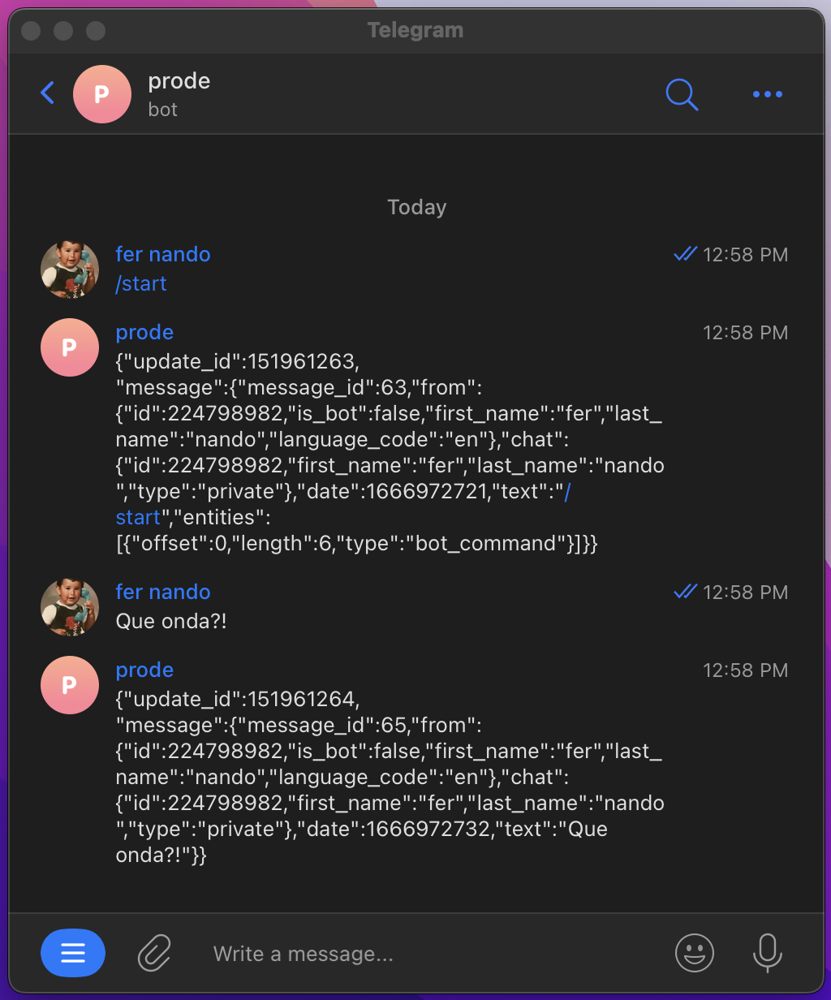

# Bot Telegram y AWS lambdas

Como armar un bot de telegram usando lambdas:

## Creamos un bot de telegram:

Hablamos con @BotFather creamos un bot `/newbot`y guardamos el `TOKEN`, algo parecido a esto:

```
6697623661:AAFyWZD91HiPIeaKmF89iIsxAp9lgmfXXX
```

## Ahora creamos una lambda en aws

- Utilizamos el runtime de `python 3.9` 
- Y marcamos la opcion `Enable function URLInfo`

En cuerpo de la lmabda vamos a utilizar python:

```python
import json
import requests


def lambda_handler(event, context):
    body=json.loads(event['body'])
    id=body['message']['chat']['id']
    base_url = 'https://api.telegram.org/bot**TOKEN**/sendMessage'
    payload={'text': event['body'],
            'chat_id': str(id)}
    requests.request("POST", base_url, data=payload)
    return {
        'statusCode': 200
    }

```
Y para que use la libreria requests tenemos que usar una layer con esa libreria.

```
arn:aws:lambda:us-east-1:770693421928:layer:Klayers-p39-requests:8
```
## Por ultimo creamos un link entre nuestro bot y la lambda:

Para hacer esto necesitamos hacer un requests POST a:
```
https://api.telegram.org/bot**TOKEN**/setWebhook
```

Con el body:

```json

{
    "url": "URL de nuestra LAMBDA"
}
```

Si todo sale bien, deberiamos recibir la respuesta:

```json
{
    "ok": true,
    "result": true,
    "description": "Webhook is already set"
}
```
## Finalmente probamos el bot:




## Links:

https://aws.plainenglish.io/develop-your-telegram-chatbot-with-aws-api-gateway-dynamodb-lambda-functions-410dcb1fb58a
